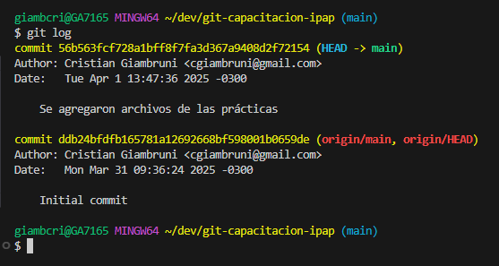
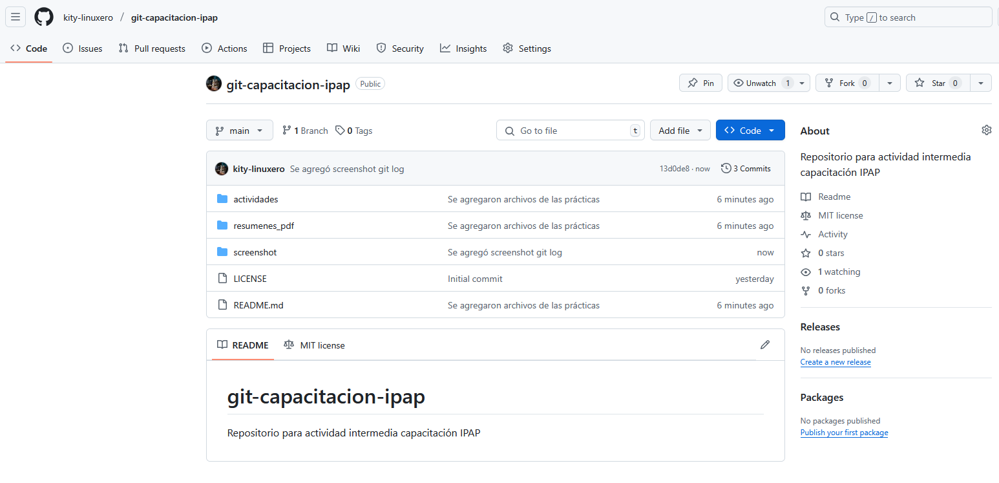

# git-capacitacion-ipap
Repositorio para actividad intermedia capacitación IPAP

- [x] **Crear un repositorio en Gitlab o Github y agregar los archivos de texto relacionados a la clase (actividades, resoluciones de las actividades, anotaciones que pueden ser públicas, imágenes, gráficos, datos, etc).**

- [x] **Crear al menos dos versiones (commits) distintas y obtener una captura con la salida del comando logs donde se vean esos commits.**

- [x] **Pushear el proyecto y obtener una captura del directorio raíz del proyecto en la plataforma utilizada (Github o Gitlab).**

- [x] **Enumerar y describir las principales diferencias entre Subversion y Git (no más de 1 carilla).**

Git es actualmente el sistema de control de versiones mas utilizado, por diferencia.
Hay varias diferencias entre Git y Subversion (SVN), pero entre la mas destacada es la arquitectura: Mientras que para subversion se requiere un servidor _centralizado_, Git tiene una arquitectura de repositorios _distribuída_. 
Esto hace que en Git podamos trabajar, incluso sin conexión al servidor (por ejemplo, sin conexión a internet), mientras que no se tenga que hacer un `push`.

Se considera que SVN tiene una curva de aprendizaje mas favorable respecto a Git, pero esto no ha sido impedimento para que Git se convierta en el sistema de versionado mas popular.

Hay algunas diferencias también en la estructura de directorios. En SVN, cada referencia, snapshot de un commit en un proyecto es organizado en subdirectorios específicos. Por ejemplo, en SVN, el directorio `trunk` tiene la última release estable de un proyecto y una feature en la que se está trabajando está sobre un directorio `branches`. En Git, en cambio, todo se mantiene en un solo directorio y el sistema Git _oculta_ los archivos y cambios que estén en otra rama o branch.

Fuentes: 

[LabITStudio](https://labitstudio.com/diferencias-sistemas-control-de-versiones/)
[Github Documentation](https://docs.github.com/en/enterprise-server@3.12/get-started/working-with-subversion-on-github/what-are-the-differences-between-subversion-and-git)

- [x] **Enumerar y describir las principales diferencias entre Gitlab y Github (no más de 1 carilla).**

GitLab y GitHub son muy similares ya que ambas plataformas trabajan son el sistema de versionado Git, sin embargo se pueden encontrar ciertas diferencias. Cabe aclarar que Github cuenta con el mayor número de usuarios y repositorios disponibles. GitHub fue adquirido por Microsoft en 2018.

### Licencias e instalación en servidor propio

Ambos programas cuentan con una versión gratuita y una versión Enterprise para empresas, que, a su vez, cuenta con numerosas opciones de suscripción con diferentes funciones.

En principio, ambas plataformas se pueden instalar en un servidor propio. Pero, en el caso de GitHub, para ello se requiere la versión Enterprise de pago para realizar. En cambio, GitLab también permite hospedar el programa en un servidor propio con la Community Edition gratuita.

### Integración Contínua

En GitHub no se 

### Terminología diferente

| GitHub         | GitLab          | Significado                                                         |
|----------------|-----------------|---------------------------------------------------------------------|
| `pull request` | `merge request` | Integra un branch a la rama principal                               |
| `Gist`         | `Snippet`       | Fragmento de código                                                 |
| `Repository`   | `Project`       | Lugar donde se almacena el código. Los archivos, configuración, etc |
| `Organization` | `Group`         | Nivel en que los usuarios son asignado a proyectos                  |

